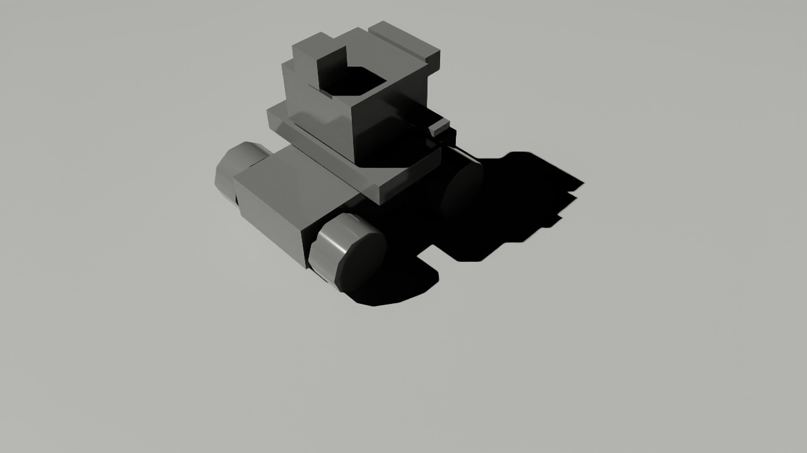

# 4-Wheel Differential Drive Robot Simulation (IsaacSim)



See also:
[differential_drive_test](https://github.com/StuartGJohnson/differential_drive_test)

## About

This package provides a (custom) 4-wheel skid-steer robot for simulation in isaacsim. 
It also provides scripts for launching the robot. World generation is not included
in this package. 

A few choices/compromises have been made to make simulator development more transparent and tractable:
- USDA (NOT USD) format is used for all worlds and robots. The binary USD format is utterly inexplicable. Since I am defining robots and worlds with geometric primitives, this is fairly straightforward. USDA can be edited and rebuilt directly.
- Action Graphs are all defined in python. These Action Graphs are added to the world/robot on simulator startup.

## Robot
This is a custom robot based on the Waveshare UGV02. The base robot is augmented with compute and sensors:
- Waveshare UGV02 (base model only)
- NVIDIA Orin compute
- Goal Zero 100 Wh battery (Orin supply)
- U-blox 7 GPS (USB)
- LDRobot STL-19P Lidar (USB)
- Intel D4535 RGBD Camera (USB)

The robot is originally defined in an XACRO file for gazebo simulation. Converting such a robot file to a USDA file for isaacsim is a fraught process. There is no conversion process that I found which would convert my XACRO/URDF file to an equivalent robot after IsaacSim ingestion without modification. I do not consider GUI steps part of a reproducible workflow (e.g., URDF ingestion via the isaacsim GUI). The following steps were used to generate a reasonably faithful USDA model of the robot.
- conversion to URDF using xacro (ROS2)
- conversion of URDF to USD using IsaacLab
- conversion of USD to USDA using `pxr.Sdf`, which is installed with IsaacSim 4.5. See `tools/usd_to_usda.py`.
- follow-up editing and tweaking of robot USDA files.

There were many issues with the USDA files generated by the conversion process above. However, since we are using USDA files, these can all be fixed with a text editor. One of the major problems was the translated USDA schema structure being flattened as opposed to hierarchical. XACRO/URDF XML formats nicely flatten the specification of joints, visuals, collisions and sensors. USDA requires careful construction of the schema hierarchy, especially to insure the articulation magic (controlled robot parts - like wheels) works properly. Also note it is incredibly useful to define a `base_footprint` coordinate system which is a parent of all robot components.

One advantage of the conversion process is that it separated the usda file into a composition file which then includes a base, physics and sensor file:
- `usd_assets/robot.usda`
- `usd_assets/configuration/robot_base.usda`
- `usd_assets/configuration/robot_physics.usda`
- `usd_assets/configuration/robot_sensor.usda`

## Requirements

This package was developed on Ubuntu 22.04/ROS2 Humble/IsaacSim 4.5. IssacLab was also used in the URDF conversion process.
IsaacSim installation was accomplished using Nvidia instructions (for IsaacSim 4.5):

[IssacSim Python Installation](https://docs.isaacsim.omniverse.nvidia.com/latest/installation/install_python.html)

This was installed using a venv based on the existing system python 3.10, so access to the system ROS2 Humble installation was straightforward. This is detailed in the NVIDIA link above.

See also:
- [requirements.txt](requirements.txt)
- [ros2_pkg_list.txt](ros2_pkg_list.txt)

## Usage

### Build the Package

Source the ROS 2 environment and build the package. In your ros2 ws directory:

```bash
source /opt/ros/humble/setup.bash #(if necessary)
colcon build
source install/setup.bash
```

### Launch the Robot

After building the package, and given a world file with accompanying launch metadata:

```bash
ros2 launch isaacsim_differential_drive_robot_4wheel isaac_sim.launch.py world:=<world>.usda robot:=<robot>.usda
```

This script assumes an accompanying "\<world\>.yml" file such as:

```yml
area:
- 40.0
- 20.0
resolution: 2.0
robot_start_xy:
- -2.0
- 0.0
robot_stop_xy:
- 10.0
- -8.0
scale: 0.4
seed: 41
threshold: 0.0
```

The important data here is `robot_start_xy`.

### Control the Robot

#### Using a Keyboard

You can control the robot using the ```teleop_twist_keyboard``` package:

```bash
ros2 run teleop_twist_keyboard teleop_twist_keyboard
```

Note that open-loop robot behavior (i.e. teleop with unit gains on linear and angular velocity) is quite poor with isaacsim. If you increase angular velocity gain (see the running teleop menu), teleoperation is ... tolerable. See the section on Open-loop robot behavior. 

## Sensor Support

Current sensors are lidar (2d), rgbd camera, and IMU. GPS support will be added.

## Transform Tree

The transforms broadcast during simulator operation are described in the test repo/ROS2 package:

[differential_drive_test](https://github.com/StuartGJohnson/differential_drive_test)

## Open-loop robot behavior

Robot behavior is described in the Open-loop robot behavior section in the test repo/ROS2 package:

[differential_drive_test](https://github.com/StuartGJohnson/differential_drive_test)


## IsaacSim issues

- There are issues in IsaacSim with skid-steer robots with multiple axles. In Gazebo,
the essential settings to make skid-steer robots work well (or at least simply) was
the addition of tire slip. See the section on Open-loop behavior. In addition, see:

  - <a href="https://forums.developer.nvidia.com/t/how-to-drive-clearpath-jackal-via-ros2-messages-in-isaac-sim/275907"> Discussion of skid-steer issues</a>
  - <a href="https://forums.developer.nvidia.com/t/wheel-robot-with-4-joints-cant-move-by-differential-controller-using-action-graph-and-ros/228800/9">More discussion of skid-steer issues</a>

- IssacSim is heavily biased towards use of the isaacsim GUI, especially in tutorials. This is very annoying for reproducible work (code!). There are ways around this annoying predisposition to GUIs:
  - In defining Action Graphs, one can use various incantations of the OmniGraph `omni.graph.core.Controller` class. See, for example, `scripts/controller_add.py`. GPT4o has suggested that using `omni.graph.tools.GraphBuilder` might help, but I have not tried this. If you are an IDE user (strongly suggested for APIs!), then both of these approaches offers limited code intelligence for the ActionGraphs themselves (strings are opaque!). This slows development.
  - You can build action graphs in the isaacsim GUI, then dump them (per graph) to a USDA file. Then include them in code.
  - Use USDA file format, not USD, if possible. My models are all based on geometric primitives (for now), so this makes USDA very appealing.
